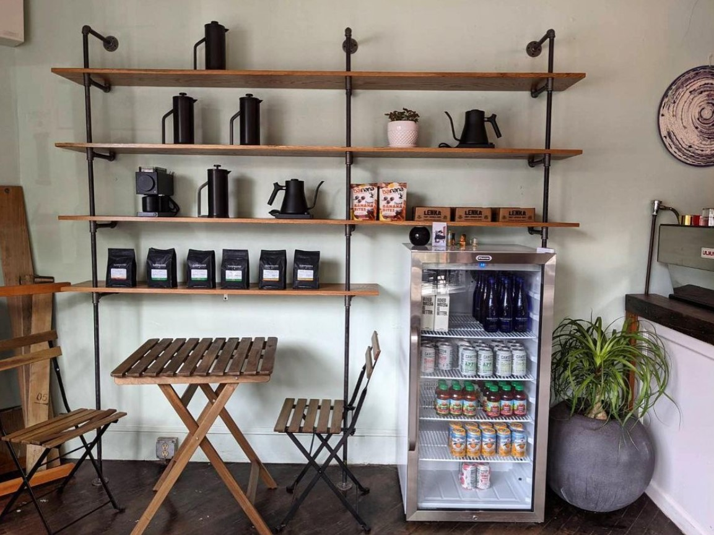

# Welcome to Tar Pit Cafe

## ~ Motorcycle-themed 3rd wave coffee shop, based in Brooklyn, NY ~

 

### Live production site available [here](placeholder)!

 

### The Stack

- Programming Language - JavaScript
- Frontend - React & Styled Components
- Styling - Bootstrap & CSS
- Framework - Create React App
- Shopping Cart - Snipcart
- Contact Form - Formspree.io

 

### This is a capstone project for Epicodus, React/C# (Part Time) track. It is an alternative website built for Tar Pit Coffee shop located in Brooklyn, NY.

 

### This is the web page for Tar Pit with information about the cafe, menu and customer reviews as well as a contact form.

 

## Table of Contents

1. [Technologies Used](#technologies)
2. [Description](#description)
3. [Setup/Installation Requirements](#setup)
4. [Known Bugs](#bugs)
5. [License](#license)
6. [Contact Information](#contact)

## Technologies Used 

- Programming Language - JavaScript
- Frontend - React & Styled Components
- Styling - Bootstrap & CSS
- Framework - Create React App
- Shopping Cart - Snipcart
- Contact Form - Formspree.io

## Description 

Functioning website made for a motorcycle-themed 3rd wave coffee shop based in Brooklyn, NY. Features special cake menus, baristas, animated Navbar and Sidebar for easy navigation.

## Project Setup/Installation Instructions 

### Clone the project

- Open the terminal on your local computer.
- Navigate to the parent directory of your preference.
- Clone this project using `$ git clone https://github.com/1ana-banana/tarpit-web`

### Install Dependencies
- Run command '$ npm install' to install dependencies required to run this app.

### Run the project

- Run the program with the command `npm start`

## Known Bugs 

- Social Media buttons are not buttons yet. 

## License 

[MIT License](https://opensource.org/licenses/MIT) © 2022 _TarPit_

## Contact 

Anastasia Han [anastasia.han@yahoo.com](mailto:anastasia.han@yahoo.com) [LinkedIn](https://www.linkedin.com/in/jungyeonhan/) [GitHub](https://github.com/1ana-banana)

